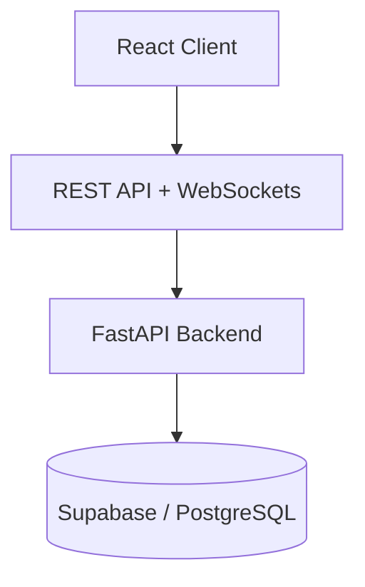

# 🚀 Unified Hub

### 🌐 The All-in-One Productivity & Collaboration Platform

---

# 🧠 Overview

Unified Hub is a **full-stack centralized productivity platform** designed to unify communication, task management, and scheduling into one seamless ecosystem.

Instead of switching between:

* Slack 💬
* Notion 📝
* Google Calendar 📅
* Trello 📊

Unified Hub combines everything into **one scalable SaaS-style web application** with real-time performance and a clean UI.

---

# ✨ Core Features

## 💬 Real-Time Chat System

* 🔴 WebSocket-based real-time messaging
* 👥 One-to-one & group conversations
* ⚡ Optimized lazy message loading
* 💾 Persistent conversation storage

## 📅 Calendar Module (Notion-like)

* Interactive calendar interface
* Event creation & scheduling
* GitHub-style activity tracking (planned)
* Smooth UI with modern UX

## ✅ Task Management (Notion Inspired)

* Create, update, delete tasks
* Workspace-based organization
* Minimal productivity-focused UI
* Scalable task architecture

## 🔐 Authentication & Security

* Secure user authentication
* Protected API routes
* Token/session-based authorization
* Backend security best practices

## ⚡ Performance Optimizations

* Pagination for chat messages
* Reduced API fetch overhead
* Efficient DB queries
* Scalable microservice-ready backend

## 🎨 Modern UI/UX

* Glassmorphism design ✨
* Dark/Light theme support 🌗
* Responsive SaaS layout
* Smooth animations & transitions

---

# 🏗️ Tech Stack

| Layer        | Technology              |
| ------------ | ----------------------- |
| 🎨 Frontend  | React.js + Tailwind CSS |
| ⚙️ Backend   | FastAPI (Python)        |
| 🔴 Realtime  | WebSockets              |
| 🗄️ Database | Supabase / PostgreSQL   |
| 🚀 Server    | Uvicorn (ASGI)          |
| 🧪 Docs      | Swagger (/docs)         |

---

# 📂 Project Structure

```bash
unified-hub/
│
├── frontend/          # React Frontend (UI + State)
├── backend/           # FastAPI Backend (API + WebSockets)
│   ├── app/
│   │   ├── main.py
│   │   ├── routers/   # API Routes (auth, chat, tasks, calendar)
│   │   ├── models/    # Database Models
│   │   ├── core/      # Config, Security, DB
│   │   └── services/  # Business Logic
│
├── docs/              # Documentation & Wiki
├── .env               # Environment Variables
└── README.md
```

---

# 🧩 System Architecture



* WebSockets → Real-time chat
* REST APIs → Tasks, Users, Calendar
* PostgreSQL → Structured data storage

---

# ⚙️ Installation & Setup

## 1️⃣ Clone Repository

```bash
git clone https://github.com/your-username/unified-hub.git
cd unified-hub
```

## 2️⃣ Backend Setup (FastAPI)

```bash
cd backend
python -m venv venv
source venv/bin/activate  # Windows: venv\Scripts\activate
pip install -r requirements.txt
```

Run Backend Server:

```bash
uvicorn app.main:app --reload
```

API Documentation:

```
http://127.0.0.1:8000/docs
```

---

## 3️⃣ Frontend Setup (React)

```bash
cd frontend
npm install
npm run dev
```

---

# 🔑 Environment Variables

Create `.env` inside backend:

```env
SUPABASE_URL=your_supabase_url
SUPABASE_KEY=your_supabase_key
SECRET_KEY=your_secret_key
DATABASE_URL=your_database_connection
```

---

# 📡 API Modules

| Endpoint    | Description                    |
| ----------- | ------------------------------ |
| `/auth`     | Authentication & Authorization |
| `/chat`     | Messaging & Conversations      |
| `/tasks`    | Task Management System         |
| `/calendar` | Calendar Events                |
| `/users`    | User Profiles & Data           |

---

# 🚀 Deployment

## 🌍 Backend

* Render

## 🎨 Frontend

* Vercel (Recommended)

---

# 📈 Future Roadmap

* 🧠 AI Productivity Assistant
* 📊 GitHub-style Contribution Calendar
* 📎 File Sharing in Chat
* 🔔 Real-time Notifications
* 🏢 Team Workspace System
* 🔗 Optional Notion API Sync

---

# 🧑‍💻 Author

### Ahmad

🎓 B.Tech Computer Engineering Student
⚡ Full-Stack Developer | System Builder

---


# ⭐ Support the Project

If you like this project, consider giving it a ⭐ on GitHub
It motivates further development and new features 🚀
